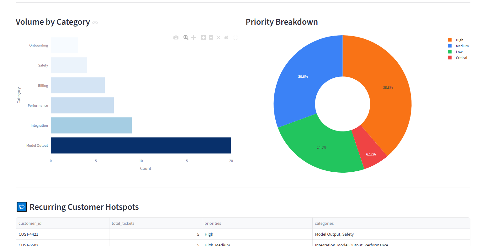
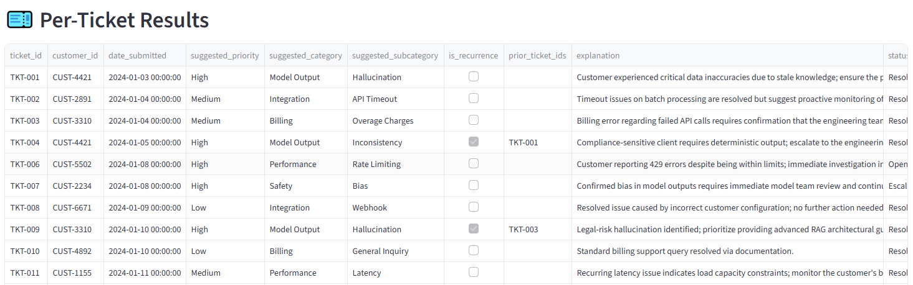

# TICKET — AI Support Triage Assistant

A Streamlit app that triages support tickets using Google Gemini AI.

## Setup

```bash
git clone <your-repo>
cd ticket

#If you would like to use a venv
python -m venv venv
source venv/bin/activate      # Windows: venv\Scripts\activate

pip install -r requirements.txt
```
## Run

```bash
streamlit run app.py
```

Open http://localhost:8501 in your browser.

## Usage

1. Upload your CSV file of support tickets in the sidebar
2. Enter Gemini API key provided in the email. (unable to upload onto GitHub for security reasons)
3. Click **Run Triage**, and wait for the AI to run through the tickets (may take longer on larger sets of data)
4. View the dashboard and per-ticket results
5. Download the enriched CSV

## Output format

**Per ticket:** suggested priority, category, subcategory,
recurrence flag, prior ticket IDs, and a plain-English explanation.

**Dashboard:** KPI tiles, volume by category, priority breakdown,
recurring customer hotspots, open/escalated backlog, satisfaction by priority.

# Sample Run

Imported the `support_tickets.csv` into the program.

## Dashboard


## Ticket results


## Why Streamlit?

A simple tool that allows for a cleaner-looking front end for the user, with minimal coding.
It also adds a lot of versatility when it comes to displaying data in different ways, such as tables, graphs, and more.
I have used it in this project mainly for this reason, but also due to my previous experience in using it.
